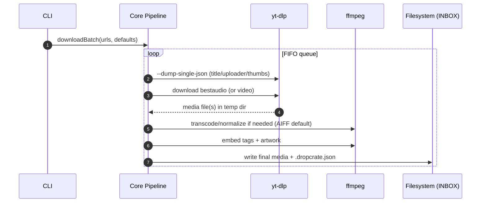

# Architecture

This repo is organized as a monorepo with a thin CLI calling a single core pipeline.

## High-level diagram

```mermaid
flowchart LR
  U[User pastes URLs] --> CLI[apps/cli]
  CLI --> CORE[packages/core]
  CORE --> YTDLP[yt-dlp (zipapp or standalone)]
  CORE --> FFMPEG[ffmpeg (ffmpeg-static)]
  YTDLP -->|media download| TMP[Temp work dir]
  TMP -->|transcode/normalize| FFMPEG
  FFMPEG --> OUT[INBOX folder]
  CORE --> OUT
  OUT --> RB[Rekordbox watch-folder import]
```

## Processing pipeline (per track)



## Components

### `apps/cli`
- Owns argument parsing and human-friendly progress.
- Calls `downloadBatch()` in `@dropcrate/core`.

### `packages/core`
- All “product logic”: download selection, temp management, audio processing, tagging.
- Minimal external surface area so the future GUI can call the same API.

## Storage model

- **Filesystem is source of truth**: the final track file is the primary artifact.
- **Sidecar JSON is provenance**: captures source URL/ID and processing defaults for audit/debug.

## Why the default is AIFF + normalization

YouTube sources vary wildly in loudness. DJs need consistent playback volume when previewing and in set prep. By default we:
- normalize to a predictable loudness target
- output AIFF to avoid codec surprises in club workflows

Details: `docs/metadata.md:1`

